# Chinese Discovery Dish Alternative
A cheaper, portable dish antenna for general weather satellite reception.

## Getting the dish
Search "LTE MIMO Dish antenna" or "LTE Dish antenna" on AliExpress and you are likely to find it in the top results. You can also try negotiating with seller to buy the dish alone for a lower price without the mount and the feed, as you would need a different feed for weather satellite reception anyway. The price fluctuates often, so it's worth waiting for a sale or discount.

## Dimensions
The four reflector plates are made out of powder coated aluminum, fit in a regular backpack, and assemble into a 60cm prime focus dish.

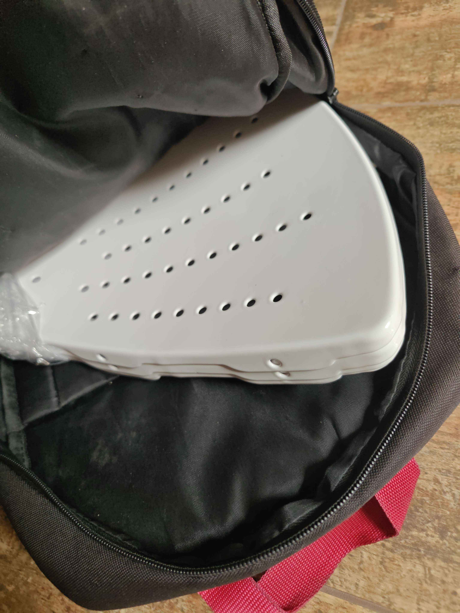

Standard metric hardware is supplied with the dish. M5 for assembling the plates, M6 for attaching the feed/feedarm adapter. I ended up using the supplied bolts, but replaced the nuts with stainless wing nuts to simplify the assembly. Four M6 and eight M5 wing nuts are needed. For attaching the backfire helix, i used three M4x16 nylon bolts with nylon nuts. 

## The feed and feedarm
You likely won't need the original feed. It's very wideband, linearly polarized - and doesn't even perform well on linear signals. I highly recommend Digitelektro's backfire helix:
https://github.com/Digitelektro/BackfireHelix  
For the feedarm, I'm using a 20 mm aluminum pipe with two printed adapters which are provided in "3d models" directory. I also recommend cutting a notch in the pipe, to prevent damage to the coax when the dish is dropped. 20 mm PVC pipe can be used as well.

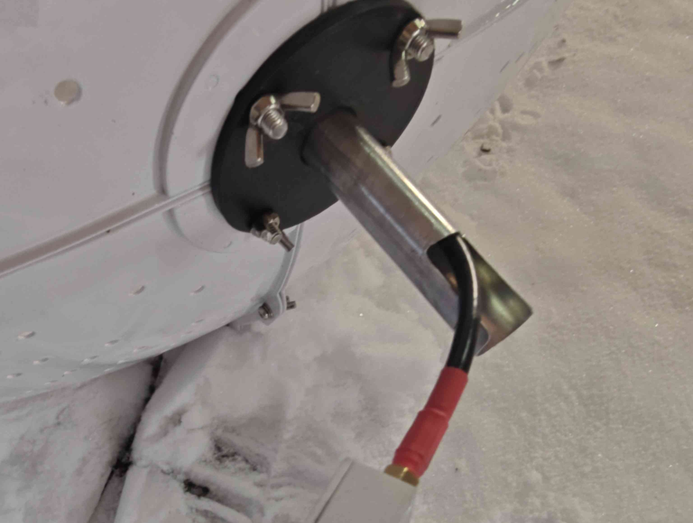

The backfire helix side adapter is Aweeri's [***backfire_helix_compact_adapter_for_discovery_dish.STL***](https://github.com/Digitelektro/BackfireHelix/blob/main/stl/backfire_helix_compact_adapter_for_discovery_dish.STL), I just added slots for M4 nuts and removed one bolt hole.  
The backfire helix requires tuning the S11 return loss/SWR to perform well which increases the difficulty. VNA and some tuning knowledge are required. Here is how I do it - but do keep in mind that there are another ways!

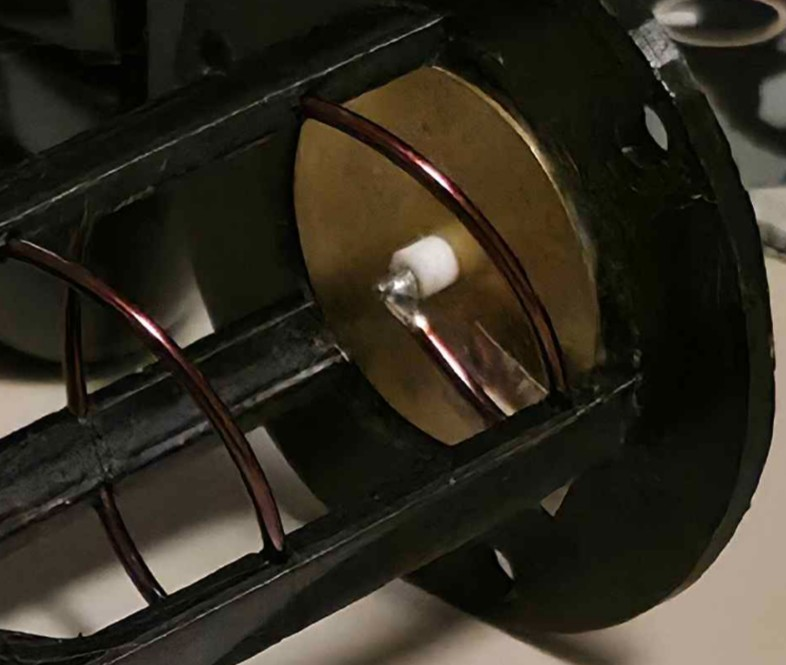
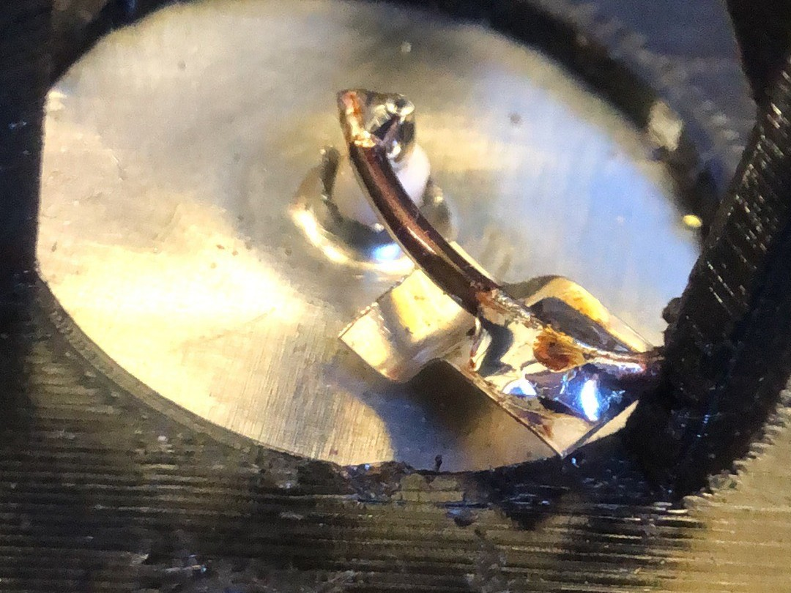

When tuning using a simple matching strip, two rough rules are worth acknowledging:  
**Distance between the matching strip and the feedpoint affects the center frequency**  
**Distance between the matching strip and the director affects the S11 Return Loss/SWR**  

#### The elephant in the room (connecting LNAs to the feed)
I opted to connect the LNA to the feed with a short coax. To make it easier, I used a female SMA on the feed. This of course sacrifices some signal strength, as we are adding insertion loss between feed and LNA and possibly some noise trough coax shield. However, I think it's more convinient than having the LNA built-in to the feedarm, and also ensures the LNA enclosure does not affect the radiation pattern.

## Dish assembly
I recommend assembling the dish on a flat, level surface. Start with connecting all plates together with bolts without fully tightening them. Place the dish reflector-side down on a flat surface, and now gradually tighten the bolts. Finally, attach coax to your feed and mount the feedarm and the helix itself.

## Focal point adjustments
To get the best performance, I recommend adjusting the focal point on a test signal, like Elektro L2/L3/L4 for L-band, or SBIRS-GEO 1 (USA 230) for S-band.
SatDump software is commonly used for weather satellite reception, and it has the required pipelines (at least for L-band) to live decode the signal for real time SNR feedback.
For L-Band just use Elektro-L and the GGAK pipeline, adjust the focal lenght while watching the SNR. Keep in mind that GGAK pipeline is notoriously "fiddly" to get a lock, sometimes you'll have to tick the SDR frequency a couple kHz up or down to get a lock. If you don't have Elektro-L LOS, Arktika M2 also transmits GGAK on 1703 MHz, and there's a pipeline for it as well, named accordingly. Keep in mind that Arktika M1 does not transmit GGAK at all, and M2 transmits only at certain altitudes; usually > 30000 km.
For S-band it's a bit trickier; you'll have to use advanced mode and make temporary changes to Metop AHRPT pipeline (modulation to oqpsk, symbol rate to 2500000):

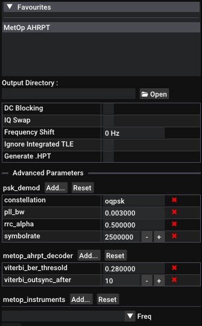

If you don't want to change the settings every time you need to test something, I have attached a SatDump pipeline for this satellite. You can copy it to `satdump/resources/pipelines` directory if you'd like to use it.  
Assemble your S-Band setup, set the frequency to 2262.5 MHz, start the pipeline and point your dish at SBIRS-GEO 1 (USA 230). Once you get a SNR readout, you can start adjusting the focal point for best SNR.
If your SDR has a DC spike, offset tuning and DC Blocking are advised.

## Weather satellite benchmarks

### Meteor M2-3, M2-4

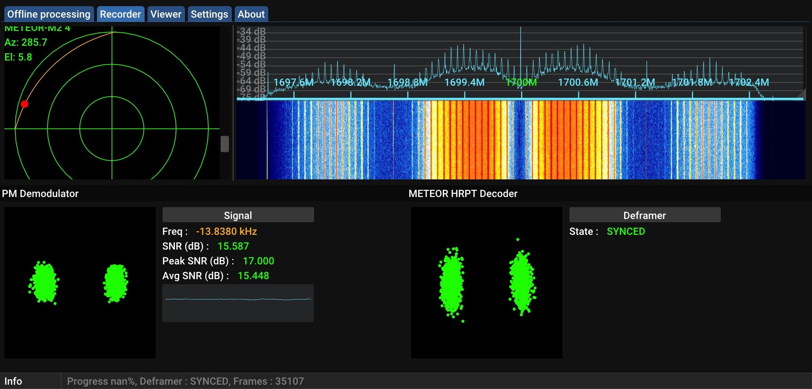
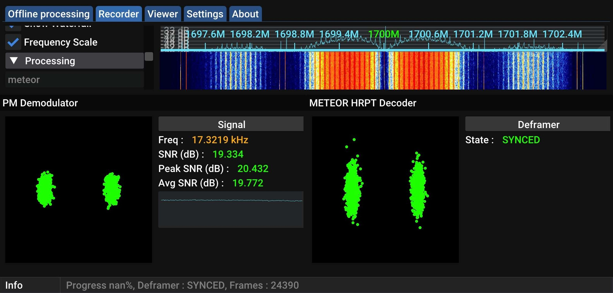

### Metop B/C
Keep in mind that Metop B has intermittent modulator issues, which causes a distorted constellation and lower SNR.

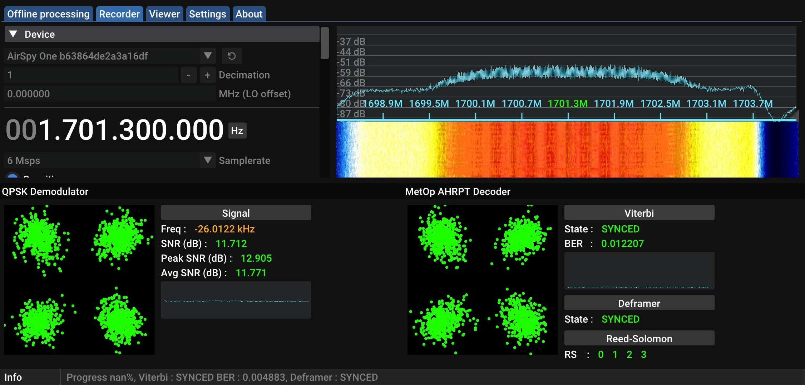
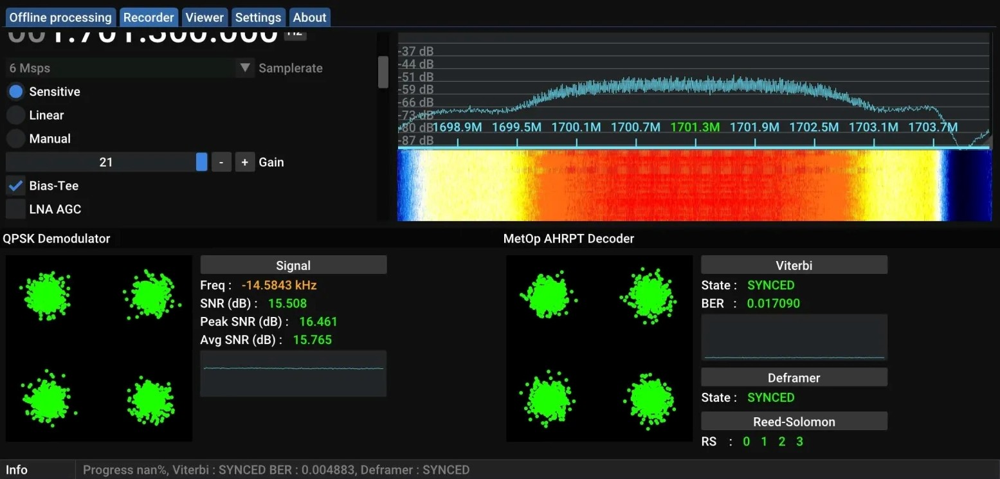

### Elektro L2

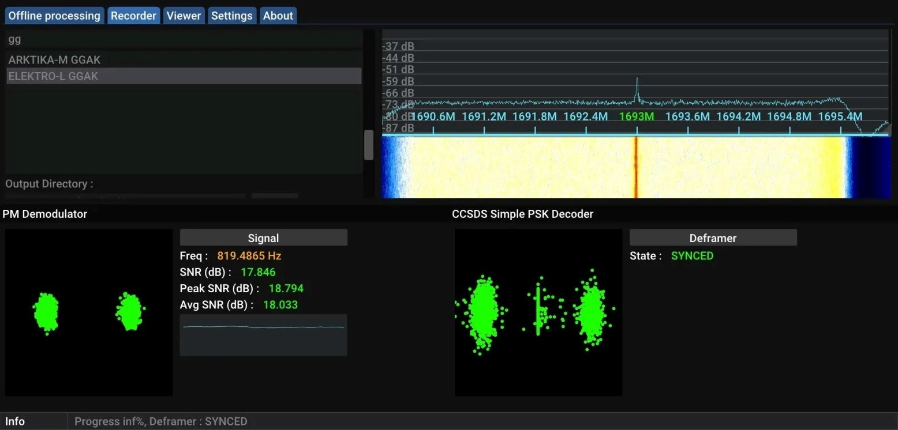

### Arktika M2 

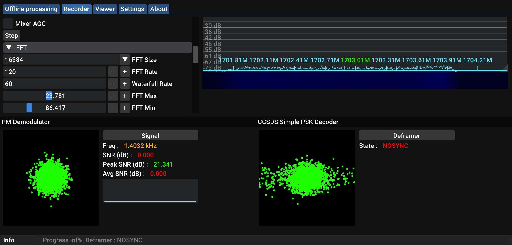

### Proba 2

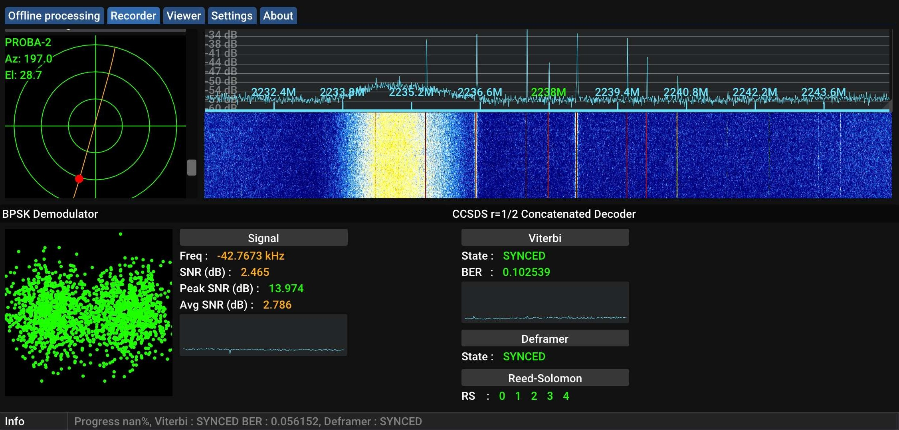

### DMSP F17

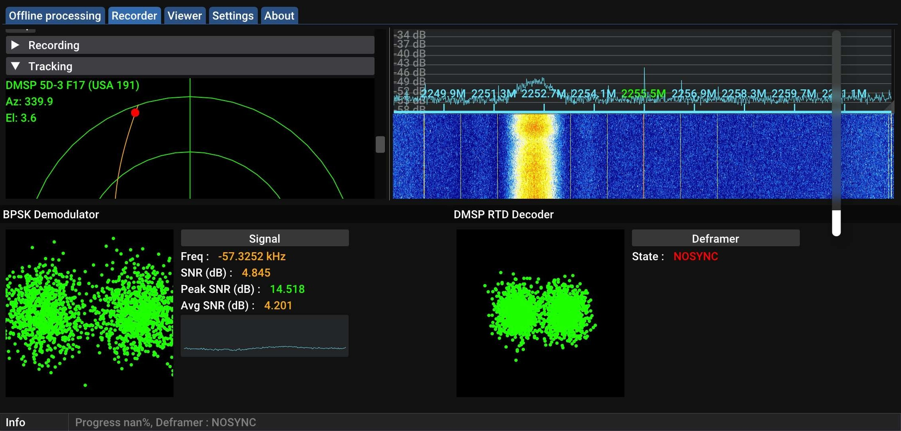
